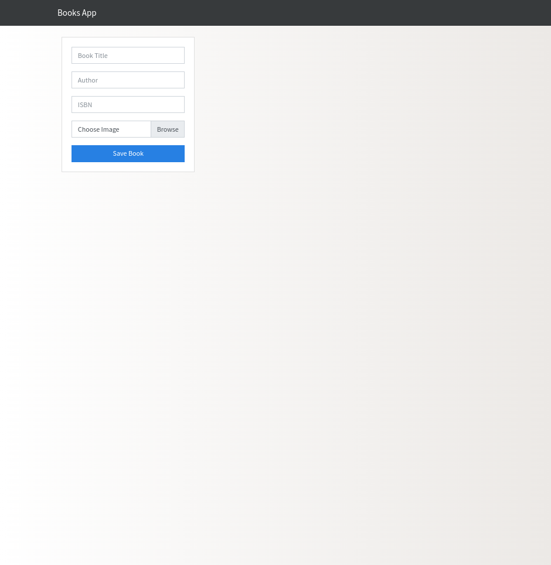

# Aplicacion fullstack
Aplicacion javascript puro desde cero, hasta despliegue en la nube.

## Modelos de negocio


Creamos un prototipo con HTML5 en ./template de la aplicacion.
Hacemos una analisis de requerimientos y procedemos a instalar los modulos necesarios para construir el backend con Nodejs.
```
    npm init -y
    npm install cors cross-env dotenv express fs-extra mongoose morgan multer
```
Explicacion: 
   Usaremos un servidor minimalista, Express js. donde podremos servir archivos del frontend, podremos ver los logs desde el servidor backend gracias al modulo morgan.
   El usuario podra guardar y ver tareas pendientes, 


Para iniciar servidor de desarrollo.
```
    npm install
    npm run dev
```
